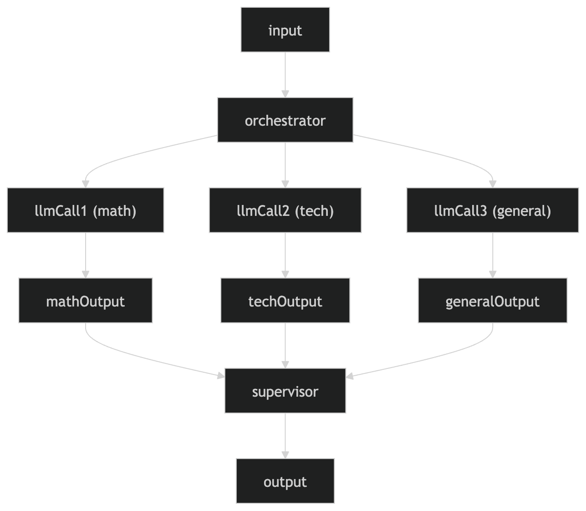

# TrustAstrology Assignment

Live demo: [https://trustastrology-assignment.vercel.app](https://trustastrology-assignment.vercel.app)

TrustAstrology is a full-stack chat application built with Next.js App Router, MongoDB, and a multi-step AI response workflow. It supports account-based chat sessions, persistent conversation history, and session naming based on the user’s first message.

## What this project includes

- Authentication flow (register and login)
- Session-based chat experience
- MongoDB persistence for sessions and messages
- Server-side orchestration endpoint for AI responses
- Markdown rendering for assistant replies with sanitization
- Real-time sidebar title updates after first user message

## Tech stack

- Next.js (App Router)
- TypeScript
- MongoDB + Mongoose
- Tailwind CSS
- Zod
- `react-markdown`, `remark-gfm`, `rehype-sanitize`

## Setup and installation

### 1) Clone repository

```bash
git clone <your-repo-url>
cd trustastrology-task
```

### 2) Install dependencies

```bash
bun install
```

### 3) Configure environment

Create `.env` in project root and add required values:

```env
MONGODB_URI=your_mongodb_connection_string
GEMINI_API_KEY=your_gemini_api_key_here
NEXTAUTH_SECRET=your_nextauth_secret_here
```

If your `workflow.ts` uses additional provider keys, include them here.

### 4) Run project

```bash
bun run dev
```

Application runs at:

```text
http://localhost:3000
```

## Available scripts

```bash
bun run dev
bun run build
bun run lint
```

If you prefer npm, use equivalent npm scripts from `package.json`.

## Project structure

```text
src/
  app/
    (main)/
      auth/
        login/page.tsx
        register/page.tsx
      chat/
        [sessionId]/page.tsx
        layout.tsx
      _components/
        Sidebar.tsx
        ChatMessage.tsx
        LogoutButton.tsx

    (backend)/
      api/
        (auth)/
          login/route.ts
          register/route.ts
        agent/route.ts
        create-sessions/route.ts
        messages/route.ts
        sessions/route.ts
      _models/
        User.ts
        ChatSession.ts
        Conversation.ts

  utils/
    dbConnect.ts
```

## Core backend architecture

### Chat session model

`ChatSession` stores session-level metadata:

- `_id` (used by frontend route as `sessionId`)
- `userId`
- `title`
- `createdAt`
- `updatedAt`

The sidebar is driven by this collection.

### Conversation model

`Conversation` stores the message stream:

- `sessionId`
- `messages[]` with `{ role, content, timestamp }`
- optional `user_id`
- `createdAt`
- `updatedAt`

The chat page loads conversation history from this collection.

### Agent request flow

`POST /api/agent` performs the complete write/respond flow:

1. Connect to DB
2. Ensure `ChatSession` exists (upsert)
3. Insert user message into `Conversation`
4. Call orchestrator (`getOrchestratedAnswer`)
5. Insert AI message into `Conversation`
6. Return `{ answer }`

#### Agent Architecture Diagram:



Session title behavior:

- If a session is created from first message, title is derived from that message.
- If the session already exists as `New Chat`, it is updated after first message.
- Sidebar is updated immediately through client broadcast event.

## API routes

### `POST /api/(auth)/register`

Creates user account and returns:

```json
{
  "userId": "..."
}
```

### `POST /api/(auth)/login`

Authenticates user and returns login payload.

### `POST /api/create-sessions`

Creates a new session for a user.

Request:

```json
{
  "userId": "..."
}
```

Response:

```json
{
  "sessionId": "..."
}
```

### `GET /api/sessions?userId=<id>`

Returns sidebar sessions for the user.

### `GET /api/messages?sessionId=<id>`

Returns message history for the session.

### `POST /api/agent`

Request:

```json
{
  "query": "user message",
  "sessionId": "...",
  "userId": "..."
}
```

Response:

```json
{
  "answer": "..."
}
```

## Frontend behavior

### Sidebar

- Fetches sessions by `localStorage.userId`
- Provides new session creation
- Supports open/close toggle
- Reflects title updates immediately after first message

### Chat page

- Uses dynamic route `chat/[sessionId]`
- Loads messages on route mount
- Sends prompt to `/api/agent`
- Appends assistant response in UI
- Broadcasts session title update to sidebar

